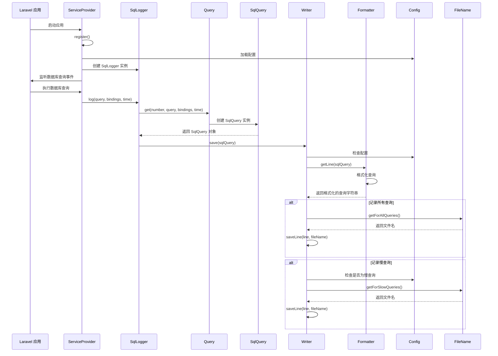

# Laravel SQL Logger 开发文档

## 项目概述

Laravel SQL Logger 是一个用于 Laravel/Lumen 框架的 SQL 查询日志记录工具。该工具可以记录所有 SQL 查询和慢查询到日志文件中，帮助开发者在开发过程中验证查询是否有效，并确保应用程序不会运行过多或过慢的数据库查询。

## 功能特点

- 记录所有 SQL 查询到日志文件
- 记录慢查询到单独的日志文件
- 可配置的查询格式化
- 可配置的日志文件命名和存储位置
- 支持 Laravel 和 Lumen 框架
- 支持命令行（Artisan）和 HTTP 请求的查询日志区分
- 可通过环境变量轻松配置

## 系统架构

Laravel SQL Logger 通过监听 Laravel 的数据库查询事件来捕获 SQL 查询，然后根据配置将查询记录到指定的日志文件中。

### 核心组件

1. **ServiceProvider**: 负责注册服务和监听数据库查询事件
2. **SqlLogger**: 主要日志记录器，处理查询日志的入口点
3. **Query**: 创建 SqlQuery 对象
4. **SqlQuery**: 表示单个 SQL 查询的对象
5. **Writer**: 负责将查询写入日志文件
6. **Formatter**: 格式化 SQL 查询以便记录
7. **Config**: 处理配置选项
8. **FileName**: 生成日志文件名

## 调用流程图



## 关键类和函数

### 1. ServiceProvider

**路径**: `src/Providers/ServiceProvider.php`

**主要职责**:
- 注册服务
- 合并配置
- 监听数据库查询事件

**关键函数**:
- `register()`: 注册服务和监听器
- `shouldLogAnything()`: 检查是否应该记录任何查询
- `getListenClosure()`: 获取用于监听数据库查询的闭包函数

### 2. SqlLogger

**路径**: `src/SqlLogger.php`

**主要职责**:
- 处理查询日志的入口点
- 记录 SQL 查询

**关键函数**:
- `log(query, bindings, time)`: 记录 SQL 查询

### 3. Query

**路径**: `src/Query.php`

**主要职责**:
- 创建 SqlQuery 对象

**关键函数**:
- `get(number, query, bindings, time)`: 创建并返回 SqlQuery 对象

### 4. SqlQuery

**路径**: `src/Objects/SqlQuery.php`

**主要职责**:
- 表示单个 SQL 查询
- 存储查询相关信息

**关键函数**:
- `get()`: 获取完整的查询（带绑定值）
- `raw()`: 获取原始 SQL（不带绑定值）
- `time()`: 获取查询执行时间
- `number()`: 获取查询编号
- `bindings()`: 获取查询绑定值

### 5. Writer

**路径**: `src/Writer.php`

**主要职责**:
- 将查询写入日志文件

**关键函数**:
- `save(sqlQuery)`: 保存查询到日志文件
- `shouldLogQuery(query)`: 检查是否应该记录查询
- `shouldLogSlowQuery(query)`: 检查是否应该记录慢查询
- `saveLine(line, fileName, override)`: 保存一行到日志文件

### 6. Formatter

**路径**: `src/Formatter.php`

**主要职责**:
- 格式化 SQL 查询以便记录

**关键函数**:
- `getLine(sqlQuery)`: 获取格式化的行
- `queryLine(query)`: 获取查询行
- `originLine()`: 获取来源行（请求或命令行）
- `time(time)`: 格式化时间

### 7. Config

**路径**: `src/Config.php`

**主要职责**:
- 处理配置选项

**关键函数**:
- `logDirectory()`: 获取日志目录
- `logAllQueries()`: 是否记录所有查询
- `logSlowQueries()`: 是否记录慢查询
- `slowLogTime()`: 获取慢查询时间阈值
- `entryFormat()`: 获取条目格式

### 8. FileName

**路径**: `src/FileName.php`

**主要职责**:
- 生成日志文件名

**关键函数**:
- `getForAllQueries()`: 获取所有查询的文件名
- `getForSlowQueries()`: 获取慢查询的文件名
- `createFileName(fileName)`: 创建文件名
- `parseFileName(fileName)`: 解析文件名（包含日期）

## 配置选项

配置文件位于 `publish/config/sql_logger.php`，主要配置选项包括：

### 一般配置
- `directory`: 日志文件保存目录
- `use_seconds`: 是否以秒为单位显示执行时间
- `console_log_suffix`: Artisan 查询日志后缀
- `extension`: 日志文件扩展名

### 格式化配置
- `new_lines_to_spaces`: 是否将换行符替换为空格
- `entry_format`: 单个条目格式

### 所有查询配置
- `enabled`: 是否记录所有 SQL 查询
- `override_log`: 是否覆盖日志文件
- `pattern`: 匹配查询的模式
- `file_name`: 日志文件名（不含扩展名）

### 慢查询配置
- `enabled`: 是否记录慢 SQL 查询
- `min_exec_time`: 慢查询的最小执行时间（毫秒）
- `pattern`: 匹配慢查询的模式
- `file_name`: 慢查询日志文件名（不含扩展名）

## 使用方法

### 安装

1. 通过 Composer 安装：
   ```bash
   composer require mnabialek/laravel-sql-logger --dev
   ```

2. 对于 Laravel < 5.5，在 `config/app.php` 中添加服务提供者：
   ```php
   Mnabialek\LaravelSqlLogger\Providers\ServiceProvider::class,
   ```

3. 对于 Lumen，在 `bootstrap/app.php` 中添加：
   ```php
   $app->register(Mnabialek\LaravelSqlLogger\Providers\ServiceProvider::class);
   ```

4. 发布配置文件：
   ```bash
   php artisan vendor:publish --provider="Mnabialek\LaravelSqlLogger\Providers\ServiceProvider"
   ```

5. 在 `.env` 文件中添加配置项：
   ```
   SQL_LOGGER_DIRECTORY="logs/sql"
   SQL_LOGGER_USE_SECONDS=false
   SQL_LOGGER_CONSOLE_SUFFIX=
   SQL_LOGGER_LOG_EXTENSION=".sql"
   SQL_LOGGER_ALL_QUERIES_ENABLED=true
   SQL_LOGGER_ALL_QUERIES_OVERRIDE=false
   SQL_LOGGER_ALL_QUERIES_PATTERN="#.*#i"
   SQL_LOGGER_ALL_QUERIES_FILE_NAME="[Y-m-d]-log"
   SQL_LOGGER_SLOW_QUERIES_ENABLED=true
   SQL_LOGGER_SLOW_QUERIES_MIN_EXEC_TIME=100
   SQL_LOGGER_SLOW_QUERIES_PATTERN="#.*#i"
   SQL_LOGGER_SLOW_QUERIES_FILE_NAME="[Y-m-d]-slow-log"
   SQL_LOGGER_FORMAT_NEW_LINES_TO_SPACES=false
   SQL_LOGGER_FORMAT_ENTRY_FORMAT="/* [origin]\\n   Query [query_nr] - [datetime] [[query_time]] */\\n[query]\\n[separator]\\n"
   ```

### 日志格式

默认情况下，日志条目的格式如下：

```
/* Origin (request): GET http://example.com/api/users
   Query 1 - 2023-09-22 10:00:00 [15ms] */
SELECT * FROM users WHERE id = 1;
/*==================================================*/
```

可以通过修改 `SQL_LOGGER_FORMAT_ENTRY_FORMAT` 环境变量来自定义格式。

## 最佳实践

1. **仅在开发环境中使用**：在生产环境中禁用此包，以避免影响应用程序性能。

2. **监控慢查询**：定期检查慢查询日志，优化性能较差的查询。

3. **合理设置慢查询阈值**：根据应用程序的性能要求，设置合适的慢查询时间阈值。

4. **使用模式过滤**：使用 `pattern` 配置选项过滤特定类型的查询。

## 扩展和定制

如果需要扩展或定制 Laravel SQL Logger，可以考虑以下方法：

1. **自定义格式化器**：继承 `Formatter` 类并重写 `getLine` 方法。

2. **自定义写入器**：继承 `Writer` 类并重写 `save` 方法。

3. **添加更多日志目标**：修改 `Writer` 类，添加对其他日志目标的支持，如数据库或远程服务。

## 故障排除

1. **日志文件未创建**：
   - 检查日志目录是否存在且具有正确的权限
   - 确保已正确配置环境变量

2. **未记录查询**：
   - 确保 `SQL_LOGGER_ALL_QUERIES_ENABLED` 设置为 `true`
   - 检查 `SQL_LOGGER_ALL_QUERIES_PATTERN` 是否匹配您的查询

3. **未记录慢查询**：
   - 确保 `SQL_LOGGER_SLOW_QUERIES_ENABLED` 设置为 `true`
   - 检查 `SQL_LOGGER_SLOW_QUERIES_MIN_EXEC_TIME` 是否设置得太高

## 结论

Laravel SQL Logger 是一个强大而灵活的工具，可以帮助开发者监控和优化数据库查询。通过记录所有查询和慢查询，它提供了宝贵的见解，帮助识别和解决性能问题。